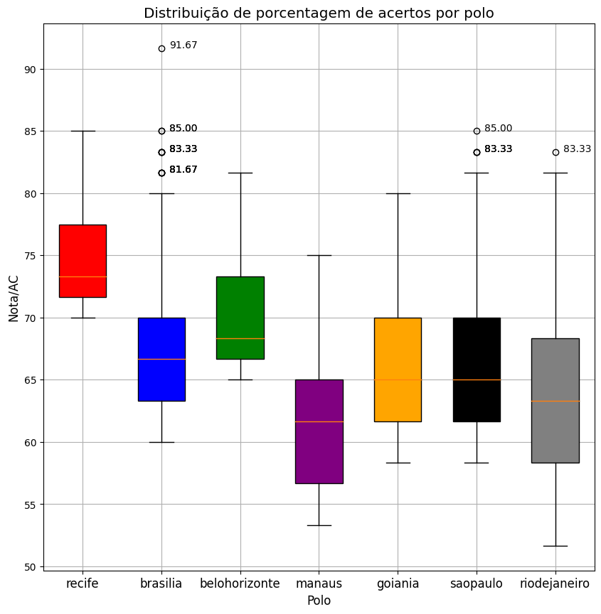

# Projeto de análise das notas dos aprovados do concurso Caixa - TBN-TI

## Objetivo

Extrair os dados das notas dos aprovados no concurso Caixa para o cargo TBN-TI (AC) do Diário Oficial da União e deixá-los prontos para análise. Por fim, analisar os dados e trazer insights relevantes sobre as notas. 
Link DOU: https://www.in.gov.br/web/dou/-/edital-n-9/2024/nm-de-05-de-agosto-de-2024-576447662

## Formato de saída dos dados

| Polo | Nota/AC |
|------|---------|
| recife     |  43       |
| belohorizonte     |    40    |
|  manaus    |   39      |

## Tecnologias usadas

- Python (Pandas, Matplotlib)
- Tableau

## Perguntas a serem respondidas pela análise

- Qual a distribuição de notas dos aprovados por polo?
- Qual a distribuição de porcentagem de acertos dos aprovados por polo?
- Qual a relação entre porcentagem de acertos e quantidade de candidatos?
- Qual a nota de corte em cada polo?

## Metodologia

O projeto seguirá as fases do Data Analytics Lifecycle:

1. **Descoberta** (Discovery): esta etapa consiste em aprender sobre o domínio do negócio, analisando o histórico da organização em análise de dados.
2. **Preparação dos dados** (Data Preparation): esta etapa consiste em extrair os dados de um sistema-fonte, converter em um formato que possa ser analisado e armazenar em um armazém ou outro sistema.
3. **Planejamento do modelo** (Model Planning): esta etapa consiste em determinar os modelos e técnicas a serem aplicadas.
4. **Construção do modelo** (Model Building): esta etapa consiste em executar o planejamento da fase anterior em cima de uma base de dados menor e selecionada para a realização de testes e treinamento dos modelos.
5. **Comunicar os resultados** (Communicate Results): esta etapa consiste em identificar os principais resultados, aferindo com o os objetivos de negócio levantados na etapa 1. 
6. **Operacionalizar** (Operationalize): esta etapa consiste nas entregas finais do projeto que podem ser relatórios, algoritmos, instruções e documentos técnicos. 

## Implementação das fases

- **Descoberta** : Nessa etapa foi compreendido o domínio do problema de análise das notas dos aprovados do concurso Caixa - TBN-TI (AC). Além disso, foram delimitadas quais perguntas de pesquisa serão respondidas. 
- **Preparação dos dados**: Os dados brutos foram obtidos, em formato analisável, a partir do código <code> extracao_csv.py </code>.
- **Planejamento do modelo**: Foram selecionadas as variáveis e métricas que melhor supriam as necessidades de pesquisa.
- **Construção do modelo**: A análise é realizada sobre uma base de dados reduzida. Tal análise é suficiente para responder as questões de negócio.
- **Comunicar os resultados**: A comunicação dos resultados é feita no próprio arquivo que contém código e análise.
- **Operacionalizar**: A análise é exportada em um formato viável para compartilhamento e execução por vários stakeholders.

## Resultados

A análise completa está presente no arquivo <code>.ipynb</code>, que pode ser visualizada no próprio github. Além disso, a análise pode ser visualizada na ferramenta Public Tableau por meio de um dashboard interativo, segue o link: https://public.tableau.com/app/profile/eduardo.vitor7126/viz/AnaliseNotaCorteCaixaAC-TBN-TI-2024/Dashboard

